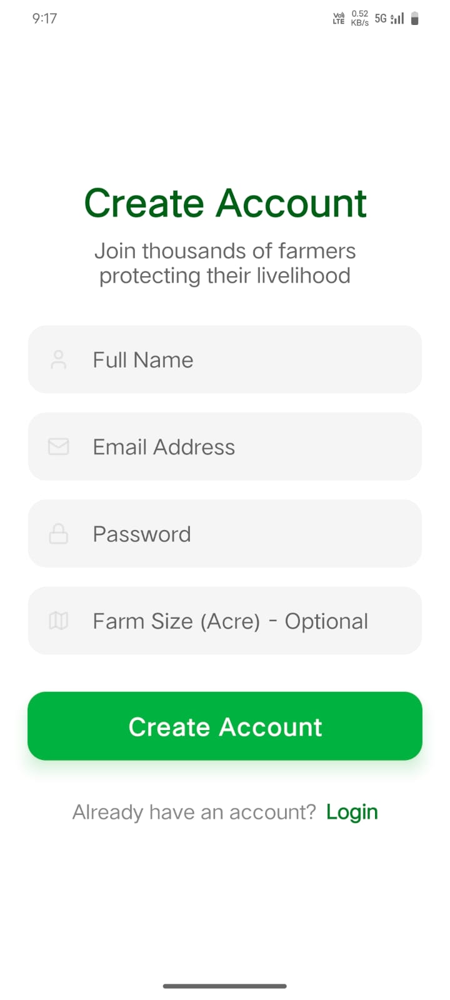
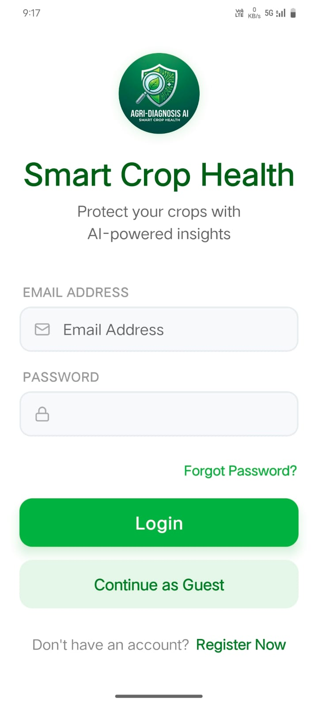
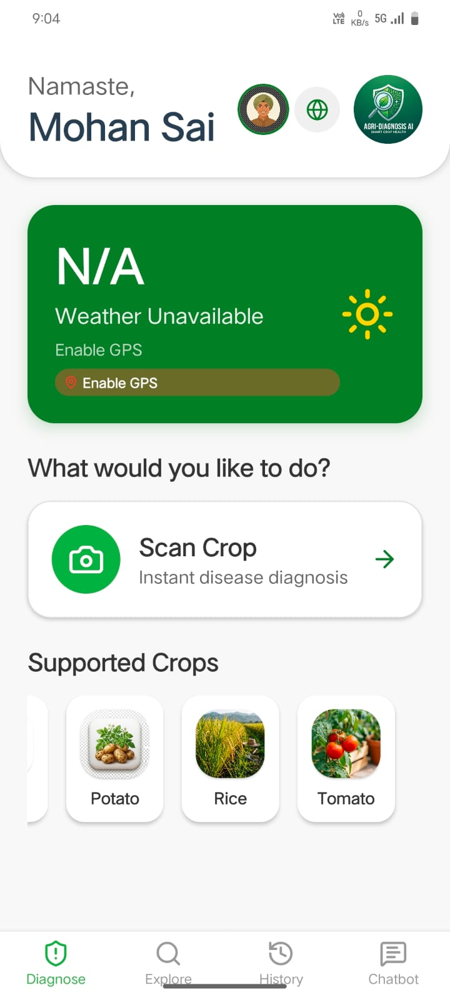
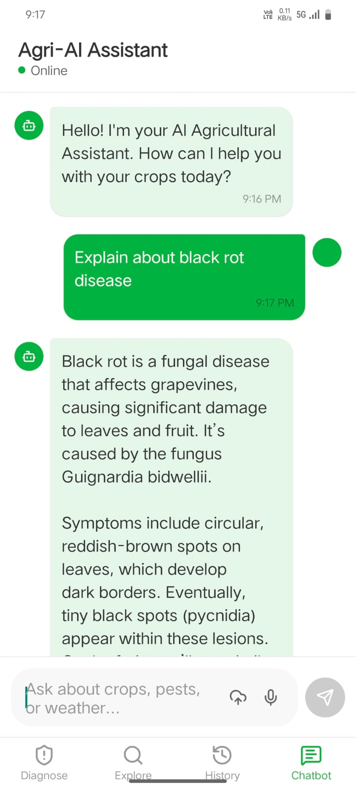
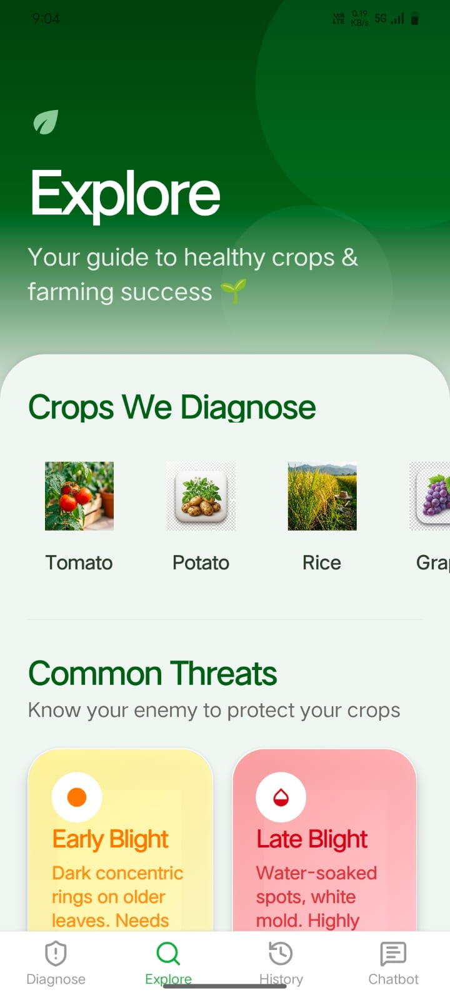
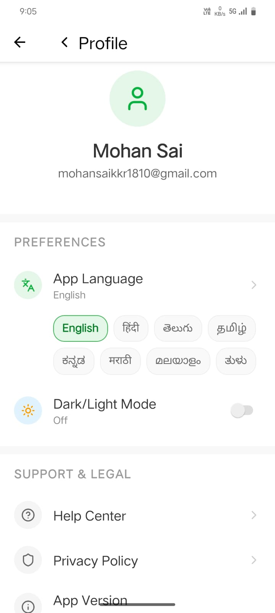

#  Agri-AI User Documentation

Welcome to the **AI Crop Diagnosis System**. This guide will help you navigate the mobile application and use its features to keep your crops healthy and productive.

---

##  Getting Started

While you can use most features of the app as a guest, creating an account allows you to save your diagnosis history and sync data across devices.

> [!NOTE]
> **Login and Registration are optional.** You can proceed as a guest to use the core features like disease detection and chatbot assistance.

### Registration
If you are a new user, fill in your details on the registration screen to create your profile.

### Login
Once registered, use your email and password to safely log in to your account.

---

##  Dashboard (Home Screen)

The Dashboard is your central hub for all agricultural activities.

### Key Features:
- **Personalized Greeting**: Welcomes you by name.
- **Real-time Weather**: Displays current temperature and weather conditions for your specific location. This is critical as many crop diseases are weather-dependent.
- **Smart Scanning**: A prominent "Scan Your Crop" button provides one-tap access to the AI diagnosis tools.
- **Supported Crops**: A quick-reference grid showing all crops currently supported by our AI models (Tomato, Rice, Potato, Grape, Maize, Cotton).

---

##  Disease Detection (Scan Mode)

Capture or upload images for instant AI analysis.

### How to use:
1.  **Select Crop**: Choose the crop you want to scan from the selection chips.
2.  **Take Photo**: Use the built-in camera to take a clear photo of the affected plant.
3.  **Upload**: Alternatively, you can upload an image from your phone's gallery.
4.  **AI Analysis**: Tap "Analyze Disease" to send the image to our deep learning models for diagnosis.

> [!TIP]
> Ensure the photo is taken in good lighting and shows the symptoms clearly for the highest accuracy.

---

##  Diagnosis Results

Understand the health of your crop and get actionable advice.

### What's on this screen:
- **Status Banner**: A clear indicator (Green for Healthy, Orange for Disease Detected).
- **Confidence Score**: Our AI tells you how sure it is about the diagnosis with a visual progress bar.
- **Severity Analysis**: Shows the percentage of the crop affected and the stage of the disease (Early, Late, etc.).
- **Voice Explanation**: Tap the "Voice Explanation" button to hear the AI explain the diagnosis and next steps in your local language.
- **Treatment Plan**: Detailed recommendations for pesticides, including dosages, frequency, and costs.
- **Prevention Tips**: Best practices to avoid the disease in the future, including organic alternatives.
- **Share Report**: Generate and share a professional PDF report of the diagnosis.

---

##  AI Chatbot (Agri-Bot)

Your 24/7 personal agricultural assistant.

### Use the Chatbot to:
- **Ask Questions**: Get instant answers about crop diseases, fertilizers, or general farming best practices.
- **Upload Media**: Send photos or videos of your crops for the AI to provide context-aware advice.
- **Voice Support**: Don't want to type? Use the microphone button to ask your questions using your voice.
- **Multilingual Support**: The bot understands and responds in several local languages.

---

##  Explore

Discover more about different crops and common diseases through the Explore screen.

---

##  Profile & History

Manage your data and revisit past findings.

### User Profile
Update your farm details, personal information, and app preferences here.

### Detection History
Access all your previous diagnosis results and reports to track your crop health over time.

