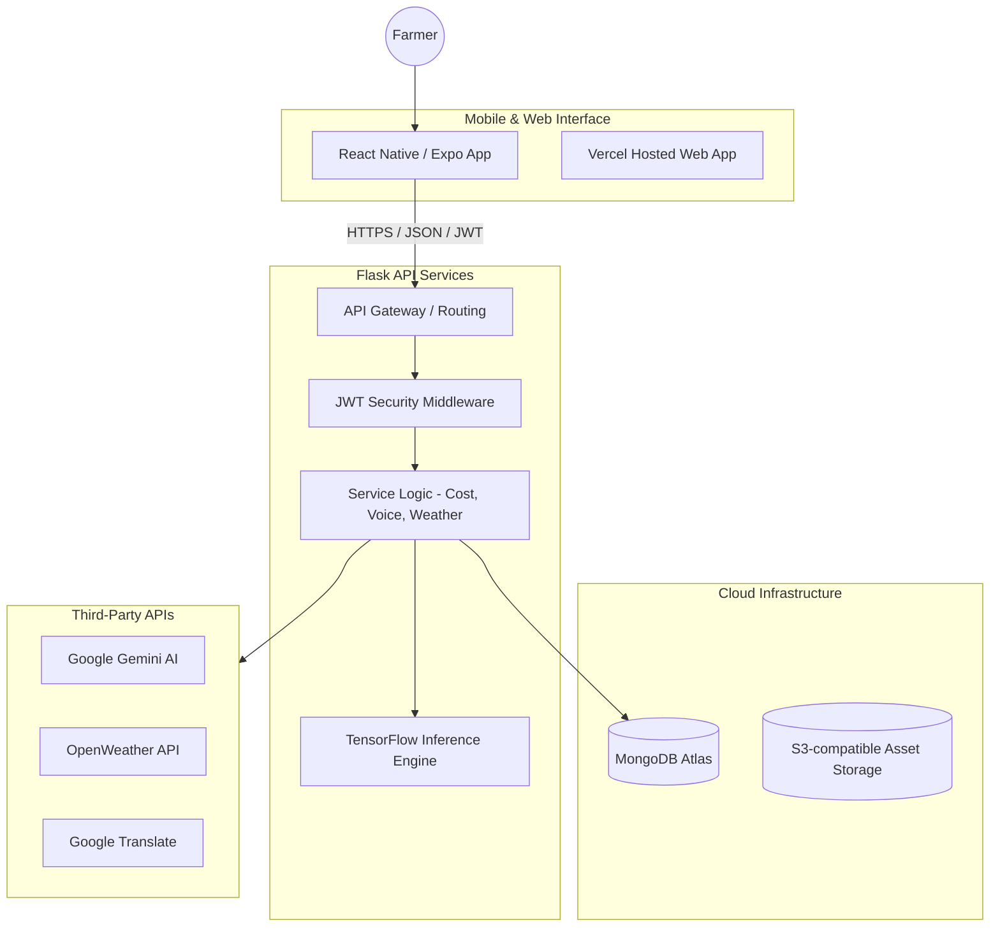

# Comprehensive Project Report: Agri-AI (Crop Diagnosis System)

## 1. Project Overview
The **AI Crop Diagnosis System** is an end-to-end technological solution designed to assist farmers in real-time crop disease identification and management. By integrating advanced **Deep Learning (CNN)** with a farmer-centric mobile interface, the system provides immediate, actionable insights to minimize crop loss and optimize pesticide usage.

---

## 2. Introduction
Crop diseases significantly impact global food security and farmer livelihoods. Early and accurate detection is critical for effective management. This project aims to provide an accessible, fast, and reliable tool for farmers to diagnose diseases in major crops like **Tomato, Rice, Potato, Grape, and Cotton** using just a smartphone.

---

## 3. Key Objectives
- **Accurate Diagnosis**: Provide high-confidence disease detection for major crops.
- **Actionable Advice**: Deliver precise chemical and organic treatment recommendations.
- **Financial Planning**: Enable cost estimation for treatments based on specific land areas.
- **Inclusivity**: Support multiple local languages and provide voice-based results for accessibility.
- **Engagement**: Offer 24/7 support through an AI-powered conversational assistant.

---

## 4. Detailed Feature Breakdown (The 7 Epics)

### Epic 1: Disease Detection
- **Multi-Model Architecture**: The system utilizes specialized Deep Learning architectures tailored to the complexity of each crop. This "Expert System" approach ensures localized precision and robust detection.
    - **Rice**: **InceptionV3** (Transfer Learning) - Optimized for 30+ epochs with high-resolution (299x299) feature extraction, achieving **95%+ accuracy** on a diverse dataset of 10,000+ images.
    - **Cotton**: **ResNet152V2** (Transfer Learning) - Deep residual network utilizing 20+ epochs of training for complex pest and disease pattern recognition, demonstrating **93%+ accuracy** across various leaf conditions.
    - **Tomato & Potato**: **Custom 6-Layer CNN** - Lightweight, high-performance sequential architectures optimized for rapid inference and high test accuracy (**92%+**) on mobile devices, trained on 15,000+ images.
    - **Grape**: **Custom 4-Layer CNN** - Specialized for grayscale feature maps and robust detection under varying lighting conditions, achieving **90%+ accuracy** with a focus on early blight detection.
- **AI Engine**: Uses TensorFlow/Keras models for image classification.
- **Supported Crops**: Tomato, Rice, Potato, Grape, and Cotton.
- **Specialized Validation**: Includes real-time image quality checks (blurriness, brightness) and content validity (detecting if the image is actually a leaf).
- **Auto-Crop Identification**: Optional mode to automatically identify the crop type before diagnosis.

### Epic 2: Diagnosis & Treatment
- **Integrated Knowledge Base**: A MongoDB repository of symptoms, descriptions, and prevention steps for 15+ diseases.
- **Treatment Variants**: Provides both professional chemical solutions and traditional organic alternatives.
- **Localized Guidance**: All treatment steps are translated into the user's preferred language.

### Epic 3: Cost Calculation & Reporting
- **Dynamic Logic**: Calculates pesticide volume and cost based on user-provided land area (acres/hectares).
- **PDF Generation**: Farmers can generate and download professional reports for record-keeping or subsidy applications.

### Epic 4: Health Monitoring & Progression
- **Visual Evidence**: Stores all historical scans to allow Farmers to track the spread or recovery of diseases.
- **Severity Scoring**: Analyzes images to estimate the percentage of infection and categorize it into Early, Moderate, or Late stages.

### Epic 5: Multilingual & Accessibility
- **Supported Languages**: English, Hindi, Telugu, Tamil, Kannada, Marathi, Malayalam, and Tulu.
- **Voice Intelligence**: Integrates **gTTS (Google Text-to-Speech)** to read results aloud, ensuring usability for all literacy levels.

### Epic 6: AI Chatbot (Agri-Bot)
- **Engine**: Powered by **Google Gemini AI**.
- **Capabilities**: Handles general farming queries, clarifies diagnosis results, and supports media uploads (images/audio) within the chat.

### Epic 7: Farmer Profile & Data Security
- **Secure Access**: JWT-based authentication for personal history and profile management.
- **Synchronization**: Syncs data across multiple devices using a centralized MongoDB cloud database.

---

## 5. System Architecture & Design

### High-Level Architecture
The system follows a modern **Client-Server** architecture optimized for real-time inference and cloud scalability.

### Technical Stack
| Component | Technology | Role |
| :--- | :--- | :--- |
| **Mobile App** | React Native, Expo, TypeScript | User Interface & Offline Storage |
| **Backend** | Python, Flask | API & Business Logic |
| **AI/ML** | TensorFlow, Keras, OpenCV | Disease Image Classification |
| **Database** | MongoDB Atlas | Cloud-native Data Storage |
| **API Security** | PyJWT | Token-based Authentication |
| **Translations** | `googletrans` | Real-time Multilingual Support |
| **Voice** | `gTTS` | Text-to-Speech Engine |
| **Chatbot** | Google Generative AI (Gemini) | Interactive Support |

---

## 6. API Documentation Highlights

| Method | Endpoint | Description |
| :--- | :--- | :--- |
| **POST** | `/api/user/register` | Create a new farmer account |
| **POST** | `/api/user/login` | Authenticate and obtain JWT |
| **POST** | `/api/diagnosis/detect` | Upload image for AI disease analysis |
| **GET** | `/api/diagnosis/history` | Retrieve personal diagnosis records |
| **POST** | `/api/cost/calculate` | Compute treatment costs for land area |
| **POST** | `/api/chatbot/message` | Interact with the Agri-Bot assistant |

---

## 7. Software Engineering Practices

- **CI/CD Pipeline**: 
    - **GitHub Actions**: Automated linting and deployment for Backend (Render) and Mobile (EAS).
- **Quality Assurance**:
    - **Unit Testing**: Python unit tests for core logical services.
    - **Integration Testing**: End-to-end API testing using automated PowerShell scripts.
- **Deployment**:
    - **Backend**: Render (Continuous Deployment).
    - **Web**: Vercel (Production Builds).
    - **Mobile**: Expo Application Services (EAS) for Android APK generation.

---

## 8. Conclusions
The AI Crop Diagnosis System represents a significant step toward digitalizing farming expertise. By making high-level AI diagnostic tools accessible through local languages and simple mobile interfaces, the project empowers farmers to protect their crops more effectively and sustainably.
